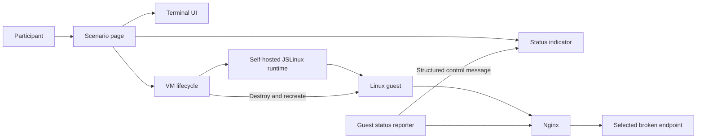

# JSLinux feasibility, design, and implementation plan

**Status:** Implemented prototype
**Last updated:** 2026-09-21
**Scope:** Browser-hosted replacement for the AWS runtime

## Executive decision

The lab can be reimplemented on JSLinux while preserving real Linux processes,
syscalls, file permissions, signals, sockets, resource limits, and tools such
as `strace` and `lsof`.

Implementation status: a lightweight x86_64/musl system image provides
challenges 1–4, and a separate MariaDB image provides database challenges.
Each browser VM runs one selected scenario, and the UI groups the two families
without describing their faults. Endpoint 5 remains out of scope because
Bellard's supplied kernel does not enable AppArmor.

The database profile runs its real application query from the guest reporter
and publishes elapsed time, matched rows, rows read, and dataset size to the
page. Completion uses result correctness, dataset integrity, and bounded
`Rows_read`; elapsed time is intentionally not a pass/fail threshold.

This is a conditional recommendation rather than a drop-in migration:

- JSLinux does not expose a guest web server to its parent page. The console
  and status UI need an explicit guest-to-browser control channel.
- The stock guest is Alpine/OpenRC, while the current lab uses Ubuntu/systemd.
  A custom guest and kernel are required for exact service-management fidelity.
- AppArmor depends on guest-kernel LSM support and is deferred from the first
  iteration.
- The published 2019 TinyEMU/JSLinux source is MIT-licensed, but the source and
  redistribution status of Bellard's updated 2026 x86_64 browser build and
  complete hosted images are not equally clear. The prototype may pin the
  publicly hosted x86_64 binaries, but redistribution requires clarification.

The recommended product model is:

1. Maintain a small set of reproducible guest profiles sharing one runtime and
   common Buildroot definitions.
2. Run one selected scenario per browser VM.
3. Select the scenario at boot and start only its required services.
4. Render the status indicator beside the JSLinux console in the parent page.
5. Reset by destroying and recreating the VM; refreshing the page has the same
   effect.

This gives per-scenario isolation without maintaining unrelated full images.
A combined "all challenges on one node" mode can be added later if it remains
useful for advanced exercises.

## Goals

- Run a scenario entirely in the participant's browser after loading static
  assets.
- Preserve genuine Linux debugging rather than simulating shell commands or
  syscalls in JavaScript.
- Make the scenario return to its initial broken state on refresh.
- Display current challenge status on the same page as the terminal.
- Avoid an always-on cloud VM or per-participant backend.
- Reuse the existing endpoint implementations and failure mechanisms where
  practical.
- Keep one build pipeline and a shared Linux base across all scenarios.

## Non-goals for the first iteration

- AppArmor/endpoint 5.
- Running multiple scenarios concurrently in one VM.
- Persisting participant filesystem changes between page loads.
- Exposing guest TCP ports directly to the host browser.
- General Internet access from the guest.
- Building compilers or endpoint binaries inside the browser.
- Replacing the existing AWS deployment before the browser version passes its
  acceptance tests.

## Current lab characteristics

The current AMI runs Nginx, PHP-FPM, four Rust services, a Go dashboard, cron,
and AppArmor under systemd. Nginx exposes five API paths and the dashboard
probes those paths through Nginx.

The scenarios exercise:

1. A poisoned `/etc/hosts` entry that breaks an outbound HTTP request.
2. Incorrect ownership of a service log directory, periodically reintroduced
   by cron.
3. A maintenance lock file.
4. `RLIMIT_NOFILE` exhaustion.
5. An AppArmor rule denying access to a configuration file.

These are operating-system failures rather than AWS-specific failures. AWS,
Packer, and Terraform provide the machine lifecycle but are not part of the
diagnostic behavior.

## Feasibility by capability

| Capability | Assessment | Notes |
| --- | --- | --- |
| Processes, signals, `/proc` | Feasible | Implemented by the guest Linux kernel. |
| `strace`/`ptrace` | Feasible, verify in spike | Ordinary syscall tracing should not depend on JSLinux's missing x86 debug registers. The exact kernel configuration must enable ptrace. |
| File ownership and modes | Feasible | JSLinux's 9P filesystem carries UID, GID, and mode metadata. |
| Ordinary lock files | Feasible | Endpoint 3 checks file presence. It does not require reliable 9P advisory locking. |
| `RLIMIT_NOFILE` and `EMFILE` | Feasible | Enforced by the guest kernel. The launch mechanism must set the service limit. |
| Loopback TCP and Nginx | Feasible | Services can communicate within the guest. |
| PHP and native binaries | Feasible | Build for the chosen guest architecture and ABI; static or musl binaries reduce dependencies. |
| Cron | Feasible | BusyBox `crond`, OpenRC, or the selected distro's cron can reproduce the behavior. |
| systemd | Conditional | Requires a custom image/kernel with the required cgroup and namespace options. Stock Alpine uses OpenRC. |
| Browser access to guest HTTP | Not provided by JSLinux | Use a status side channel rather than trying to fetch guest `localhost`. |
| Outbound Internet | Available but unsuitable as a dependency | Bellard's public relay is rate-limited and is not appropriate production infrastructure for this lab. |
| AppArmor | Deferred/conditional | Requires AppArmor-enabled kernel, securityfs, policy tools, and validation over the selected root filesystem. |
| Refresh-to-reset | Feasible | Guest writes are in-memory unless explicitly synchronized; a new VM starts from the immutable base. |

## Runtime and image strategy

### Decision: one active scenario per VM

Each scenario page starts one VM with one active fault. This is preferable to
running all challenges in every browser VM because it:

- makes refresh reset exactly the scenario the participant is working on;
- prevents one scenario's process, cron job, logs, or resource use from
  affecting another;
- reduces boot work and the active process set on JSLinux's single execution
  thread;
- simplifies status reporting and completion tracking;
- permits scenarios to have different boot requirements later, including a
  separate AppArmor-enabled variant;
- makes automated acceptance tests deterministic.

The trade-off is that participants no longer inspect one crowded production-like
node. That mode can remain an advanced exercise after the browser runtime is
stable.

### Decision: shared definitions with workload-specific image profiles

The repository maintains common guest definitions containing:

- the chosen Linux userspace;
- diagnostic tools such as `strace`, `lsof`, `ps`, `ss`, `curl`, `dig` or
  `getent`, and a text editor;
- Nginx and common runtime packages;
- shared endpoint and service definitions;
- a small boot selector and status reporter.

Two generated profiles currently inherit those definitions:

- a 192 MB system disk containing the four lightweight system scenarios;
- a 512 MB database disk containing MariaDB, database tooling, and database
  initialization scripts.

This avoids making every system participant download or initialize a database,
while retaining one emulator, kernel, frontend, and source tree.

The page passes a scenario identifier on the kernel command line, for example
`LAB_SCENARIO=endpoint3`. Early guest initialization then:

1. enables only the selected scenario's services;
2. installs or activates its initial fault;
3. starts Nginx and the status reporter;
4. emits a ready event to the page.

Files for inactive scenarios may exist in the selected profile, but their
services and injectors do not run. The split block image loads chunks lazily,
so unused database or service blocks should not enter the browser working set.

If inactive scenario files expose unacceptable spoilers or a scenario needs a
materially different kernel, the same pipeline can produce another generated
profile. Profiles must inherit common package and configuration definitions
rather than becoming independently maintained images.

## Proposed browser architecture



The deployment consists of static HTML, JavaScript/Wasm, the kernel, and
HTTP-addressable guest filesystem data. It can be hosted on object storage or a
CDN. No participant VM or application server is required.

### Page responsibilities

- scenario title and instructions;
- embedded terminal;
- boot, ready, healthy, unhealthy, and status-unavailable states;
- reset button implemented as VM teardown and recreation;
- optional full-page-refresh reset;
- local progress metadata, separate from guest filesystem state;
- clear reporting of unsupported browsers or failed asset loading.

### Guest responsibilities

- run the actual service and fault;
- provide the participant's shell;
- probe the endpoint from inside the guest;
- send only status and lifecycle events to the page;
- remain authoritative for whether a fix works.

The browser must not infer success from files or commands typed by the
participant. A successful status means the endpoint returned the expected
healthy response through the guest's normal Nginx path.

## Replacing the Go dashboard

The Go dashboard should not be included in the browser version. Its HTML server
cannot be reached from the parent page without a network bridge, and duplicating
the visible dashboard inside and outside the guest adds little value.

Replace it with:

1. a small guest-side status reporter that probes the selected path through
   `http://127.0.0.1`;
2. a structured guest-to-page transport;
3. a status component rendered next to the console.

The reporter can initially be a small POSIX shell process using the guest's
existing HTTP client. A tiny static binary is preferable later if shell process
startup materially affects emulator performance.

Example event payload:

```json
{
  "version": 1,
  "type": "challenge-status",
  "scenario": "endpoint3",
  "state": "unhealthy",
  "httpCode": 503,
  "checkedAt": "2026-09-18T17:20:00Z"
}
```

Do not send the response body or diagnostic details to the page because those
could reveal the solution.

### Control-channel transport

JSLinux does not expose guest loopback sockets to parent JavaScript. The
recommended first transport is a reserved terminal control sequence:

- the reporter writes a short, versioned message to the guest console;
- the modified terminal parser recognizes and removes the reserved sequence
  before rendering;
- the parser validates and forwards its payload to the status component;
- ordinary terminal output remains unchanged.

This is substantially smaller than implementing a browser TCP/IP bridge. The
prototype must verify that background writes do not corrupt terminal output.
Messages must be bounded, escaped, and written in one operation.

If the console transport is unreliable, the fallback is a dedicated VirtIO
console port exposed by the self-hosted emulator. That is cleaner but requires
guest-kernel and emulator-device work.

Status messages are advisory and can be spoofed or suppressed by a participant
with root access. This is acceptable for an educational self-check indicator.
Any scored or certified result should be validated outside the untrusted guest.

## Scenario migration design

### Endpoint 1: name resolution failure

Do not depend on Wikipedia or the public JSLinux network relay. Provide a
deterministic in-guest target:

- run a small known-good HTTP service on a separate loopback address;
- run local DNS that resolves a lab hostname to that address;
- inject an `/etc/hosts` entry mapping the hostname to an unreachable address;
- keep the application behavior and participant workflow centered on resolver
  order, `/etc/hosts`, and connectivity.

Removing the poisoned entry then exposes the healthy local DNS answer. This
preserves the troubleshooting lesson while making the scenario offline and
repeatable.

### Endpoint 2: log ownership and cron

Reuse the existing Rust service, dedicated UID/GID, log path, ownership fault,
and cron-based reintroduction. For short sessions, review whether the current
30-minute interval teaches recurrence or merely surprises participants.

Acceptance requires `strace` to show the failed file operation and normal
ownership changes to repair it.

### Endpoint 3: maintenance lock

Reuse the existing Rust service and lock-file behavior. This is the lowest-risk
first vertical slice because it requires only normal VFS behavior, a local
service, Nginx, and status reporting.

### Endpoint 4: file descriptor exhaustion

Reuse the existing service and low `RLIMIT_NOFILE`. Under systemd, retain
`LimitNOFILE`. Under a temporary OpenRC prototype, set the limit in the service
launcher and expose it through `/proc/<pid>/limits`.

The final choice must be documented in participant instructions: silently
changing a systemd exercise into an OpenRC exercise would reduce parity with
the current lab.

### Endpoint 5: AppArmor

Exclude this scenario from the first iteration. A later kernel spike must prove:

- `CONFIG_SECURITY_APPARMOR`;
- the required LSM selection and securityfs mount;
- successful profile loading and attachment to the endpoint executable;
- visible denial evidence in guest logs;
- normal enforcement over the chosen filesystem.

If JSLinux or its filesystem prevents faithful enforcement, replace this
scenario only after separately documenting the changed learning objective.

## Linux distribution and init system

Two stages are recommended:

1. Use the stock-compatible Alpine environment for the emulator, reset,
   terminal, status-channel, and endpoint 3 feasibility spike.
2. Build and validate a minimal custom systemd-capable guest before claiming
   parity with the current lab.

The production decision should favor systemd if it boots reliably within the
performance budget. Participants currently use units, `systemctl`, and
`journalctl`, and endpoint 4's fault is configured through a unit resource
limit. OpenRC remains a fallback only if the course accepts that curriculum
change.

## Reset semantics

The immutable filesystem served by the application is the initial broken
state. Runtime writes remain in the current VM's in-memory state.

Reset performs:

1. stop the emulator event loop;
2. detach terminal and status listeners;
3. discard the emulator and writable filesystem objects;
4. instantiate a new VM with the same scenario identifier;
5. wait for a new ready event.

Refreshing or closing the page naturally discards the same state. Browser HTTP
cache or a service worker may cache immutable base assets, but must never cache
or restore the writable guest state.

Add a generation identifier to control messages so late messages from a
discarded VM cannot update the new VM's status.

## Networking

The default lab should start with guest external networking disabled.
Everything required by a scenario runs on guest loopback.

Reasons:

- Bellard's public relay is capped at 40 kB/s and two connections per public
  IP;
- it is an external operational dependency;
- public egress makes exercises less deterministic;
- exposing guest services back to the parent browser requires additional
  forwarding that the status channel makes unnecessary.

A self-hosted relay can be evaluated later for exercises that genuinely require
Internet access. It is not required for scenarios 1-4 after endpoint 1 is made
deterministic.

## Security and browser constraints

- Host the emulator and guest assets under controlled origins with a restrictive
  Content Security Policy.
- Treat every guest control message as untrusted input. Validate schema, size,
  version, scenario identifier, and allowed status values.
- Do not insert guest strings into HTML without escaping.
- Do not expose privileged browser APIs to guest messages.
- Disable external networking by default.
- Use immutable, content-hashed kernel, Wasm, and filesystem assets.
- Verify third-party licenses and publish required notices.
- Stock JSLinux does not require `SharedArrayBuffer` or cross-origin isolation.
  A future worker/threaded fork may require COOP/COEP and a separate browser
  compatibility review.
- Desktop Chromium and Firefox are the initial targets. Safari and mobile
  browsers require measured memory and keyboard testing before support is
  promised.

## Source and licensing gate

TinyEMU and the downloadable 2019 JSLinux demo are published under the MIT
license; bundled SLIRP code has a two-clause BSD license. Bellard's live service
was updated in 2026 with x86_64 and newer instruction support, but a matching
current source release and blanket redistribution grant for its complete hosted
bundle were not identified during this evaluation.

The technical prototype uses the March 2026 x86_64 emulator and kernel binaries
from bellard.org, pinned by SHA-256, with an independently built x86_64 root
filesystem. Initial testing found that Buildroot glibc 2.41 rejects the CPU ISA
level advertised by the emulator before starting `init`, so the first working
image targets musl. Older or specially configured glibc remains a compatibility
spike for software distributed only as glibc-linked binaries.

Before distributing the resulting site:

1. obtain clarification or permission covering redistribution of the 2026
   x86_64 emulator and kernel binaries;
2. replace the precompiled runtime with a source build if matching source
   becomes available;
3. inventory licenses for the distro packages, kernel, emulator, and frontend;
4. generate and review the guest image's software-bill-of-materials and license
   output.

## Implementation plan

### Phase 0: hard-gate spike

Deliver a minimal self-hosted page that boots a license-approved JSLinux build.

Prove:

- reproducible retrieval and hash verification of the pinned emulator;
- custom kernel and root filesystem loading;
- shell interaction;
- `strace` attaching to a long-running process;
- loopback HTTP;
- runtime filesystem mutation disappearing after refresh;
- teardown/recreation without reloading static assets;
- acceptable cold and warm boot time on representative hardware.

Stop and reconsider the emulator choice if ptrace, custom image boot, licensing,
or browser stability fails.

### Phase 1: one complete scenario

Port endpoint 3 as the vertical slice:

- Nginx and the endpoint service;
- initial lock-file fault;
- terminal and reset controls;
- guest status reporter;
- browser status indicator;
- automated broken/fixed/reset checks.

This phase validates the complete product flow before introducing package,
network, or resource-limit complexity.

### Phase 2: shared image and scenario selection

- define a single image build manifest;
- cross-compile and install endpoint artifacts;
- add the `LAB_SCENARIO` boot selector;
- ensure only selected services start;
- add deterministic users, paths, logs, and fault injection;
- publish content-hashed static assets;
- measure whether inactive lazy files affect startup or memory.

### Phase 3: scenarios 1, 2, and 4

- implement endpoint 1's local DNS/upstream substitute;
- port endpoint 2 ownership and cron behavior;
- port endpoint 4 resource-limit behavior;
- verify the expected diagnostic commands and repairs;
- add per-scenario automated acceptance scripts.

### Phase 4: systemd parity and hardening

- test a minimal systemd-capable custom guest and required kernel options;
- retain OpenRC only if the curriculum explicitly accepts it;
- test Chromium and Firefox across low-, mid-, and high-spec machines;
- add load-error, boot-timeout, crashed-guest, and stale-status handling;
- perform license and supply-chain review;
- document static hosting and cache invalidation.

### Phase 5: optional extensions

- evaluate an AppArmor-enabled endpoint 5 image;
- add an advanced combined-node mode;
- add local progress persistence outside the VM;
- evaluate worker-based emulator execution if main-thread responsiveness is
  inadequate.

## Acceptance criteria

The first production candidate must demonstrate:

- a participant can diagnose and repair scenarios 1-4 using normal Linux tools;
- `strace` reports the relevant real guest syscalls;
- the visible status changes only after an in-guest HTTP probe succeeds;
- reset and page refresh restore the selected scenario's initial broken state;
- resetting one scenario does not affect another browser tab or saved progress;
- no runtime dependency on AWS, bellard.org, vfsync.org, or a public network
  relay;
- the browser never needs direct access to a guest TCP port;
- terminal output remains correct while status messages are emitted;
- assets are reproducibly built and license-reviewed;
- boot time, memory use, and UI responsiveness meet budgets established during
  phase 0 on supported browsers.

Performance thresholds should be set after the phase 0 baseline rather than
guessed from Bellard's historical 2017 benchmark.

## Risks and mitigations

| Risk | Impact | Mitigation |
| --- | --- | --- |
| Current x86_64 implementation is not available as suitable source | Blocks unrestricted redistribution and local emulator modification | Pin the prototype binaries; request redistribution permission; migrate to matching source if published. |
| Current glibc rejects the emulator's advertised x86-64 ISA baseline | Blocks unmodified glibc-only binaries | Use musl for the first scenario; test older glibc and request/source an emulator fix before promising glibc compatibility. |
| systemd kernel requirements increase boot time or fail | Reduces parity | Validate early; keep a documented OpenRC fallback and quantify the curriculum difference. |
| Status sequences interfere with terminal output | Poor participant experience | Bound and atomically write messages; stress-test; fall back to a dedicated VirtIO console. |
| Main-thread emulation makes the page unresponsive | Poor usability | Measure first; reduce active services; investigate a worker-based build only if required. |
| 9P behavior differs from a normal root disk | Scenario inconsistency | Test every expected operation; use an HTTP block image or targeted tmpfs paths where needed. |
| AppArmor is unavailable | Endpoint 5 cannot be reproduced | Keep it out of MVP; test a custom kernel separately; document any replacement. |
| Browser memory limits vary | Crashes on low-end devices | One active scenario per VM, lazy assets, explicit supported-device baseline. |
| Participants spoof the status protocol | False local completion | Treat it as self-check only; use an external verifier if results are scored. |

## Effort estimate

These are engineering estimates, not commitments:

- phase 0 feasibility and licensing spike: 3-5 engineering days;
- endpoint 3 vertical slice with page UI: 5-10 days;
- shared image plus scenarios 1, 2, and 4: 10-20 days;
- browser hardening, build automation, and documentation: 5-10 days;
- AppArmor investigation: an additional 3-10 days with a possible negative
  result.

The likely first production scope is approximately four to seven engineering
weeks for one engineer, excluding course-content changes and formal legal
review.

## Alternatives considered

### One VM containing all challenges

This most closely matches the current AWS node and keeps one Nginx/dashboard
topology. It was not selected for the first iteration because it couples reset,
adds active services and background work, complicates progress tracking, and
reduces fault isolation on a single-threaded emulator.

It remains useful as an advanced final lab after per-scenario execution is
stable.

### Independently maintained image per scenario

This provides strong isolation but duplicates distro, tools, updates, and build
configuration. It was rejected in favor of one logical base with boot-time
scenario selection within a small number of workload profiles. The system and
database profiles share their runtime and source definitions rather than being
maintained per scenario.

### Browser TCP bridge to guest services

This would let the parent page fetch port 8080 but requires an in-browser
network stack, emulator modifications, or a backend relay with forwarding. It
is unnecessary when the page needs only a small status event.

### Retaining the Go dashboard

The binary can run in the guest, but its HTTP UI is not directly reachable from
the page. Keeping it would still require a bridge and duplicate rendering. A
small internal reporter plus native page component has less runtime and product
complexity.

## Evidence and references

Repository evidence:

- `README.md`
- `src/dashboard/main.go`
- `src/endpoints/endpoint2-rs/src/main.rs`
- `src/endpoints/endpoint3-rs/src/main.rs`
- `src/endpoints/endpoint4-rs/src/main.rs`
- `src/endpoints/endpoint5-rs/src/main.rs`
- `salt/roles/challenges/init.sls`
- `salt/roles/challenges/files/`
- `salt/roles/endpoints/templates/endpoint.service.j2`
- `salt/roles/apparmor/files/opt.endpoints.endpoint5.server`
- `salt/roles/nginx/files/default.conf`

External sources reviewed on 2026-09-18:

- [JSLinux virtual machines](https://bellard.org/jslinux/)
- [JSLinux technical notes](https://bellard.org/jslinux/tech.html)
- [JSLinux FAQ](https://bellard.org/jslinux/faq.html)
- [JSLinux news](https://bellard.org/jslinux/news.html)
- [TinyEMU project](https://bellard.org/tinyemu/)
- [TinyEMU README](https://bellard.org/tinyemu/readme.txt)
- [Linux AppArmor documentation](https://docs.kernel.org/admin-guide/LSM/apparmor.html)

Claims about the live 2026 JSLinux implementation should be rechecked when
work starts because the project changed materially in January and March 2026.
